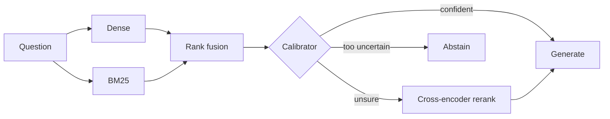

# Failure-Aware Adaptive RAG

A retrieval-augmented generation (RAG) service that **estimates whether its own retrieval
succeeded before answering**, and uses that estimate to answer quickly, rerank for better
evidence, or abstain. It ships with a real-time web engine that shows every stage of the
pipeline as it runs, an experiment monitor, and a reproducible evaluation workflow - all
running on a CPU-only laptop.

**Dataset:** [EnterpriseRAG-Bench](https://huggingface.co/datasets/onyx-dot-app/EnterpriseRAG-Bench) -
synthetic company knowledge (Slack, email, tickets, docs, code) with 500 questions,
gold documents, gold answers and per-answer facts. See [docs/DATASET.md](docs/DATASET.md).

## Highlights

| | Held-out result |
|---|---|
| Retrieval recall@10 | hybrid **0.716**, CRAG **0.730**, adaptive **0.726** (dense alone 0.388) |
| Calibrator | AUC **0.725**; Brier 0.202 vs 0.232 for a constant guess |
| Generators (first 25 of 500 questions) | Qwen2.5-7B **0.47**, Phi-3-mini 0.32, phi-2 0.22 (judge: Llama 3.1 8B) |

Full method and caveats: [docs/EVALUATION.md](docs/EVALUATION.md). Every saved result,
with its git commit and config: [results/README.md](results/README.md).

## How it works



Four strategies are served side by side - **vanilla** (dense), **hybrid** (dense + BM25),
**CRAG** (hybrid + cross-encoder correction) and **adaptive** (calibrated routing). Each
component and the reason behind it: [docs/ARCHITECTURE.md](docs/ARCHITECTURE.md).

## Quick start

```bash
../venv/bin/pip install -r requirements.txt
ollama pull qwen2.5:7b-instruct-q4_K_M
../venv/bin/uvicorn main:app --port 8000
```

- `http://localhost:8000/` - **Ask**: real-time engine (live pipeline, streaming answer, sources)
- `http://localhost:8000/dashboard` - **Monitor**: experiments, calibrator evidence, results
- `http://localhost:8000/docs` - API reference

Data loading, training and the full evaluation workflow: [docs/WORKFLOW.md](docs/WORKFLOW.md).

## Repository layout

```
api/         FastAPI routes: query strategies, live engine, monitor, results, health
core/        retrievers, fusion, chunking, CRAG corrector, calibrator, router, generator,
             live engine, service wiring, results store
pipelines/   vanilla, hybrid, CRAG and adaptive pipelines
scripts/     data fixes, training, evaluations, generator ablation, run_pipeline.sh
static/      website (Ask page, Monitor) and shared stylesheet
tests/       unit tests (no Chroma or Ollama needed)
results/     saved experiment results with provenance
models/      trained calibrator
docs/        dataset, architecture, workflow, evaluation, roadmap
```

## Status

Under construction - the full 500-question generator comparison and the calibrator
evaluation are running; next up is bandit-based (RL) routing. See [docs/ROADMAP.md](docs/ROADMAP.md).

## Requirements

Python 3.10+ (developed on 3.14), ChromaDB with the dataset loaded, [Ollama](https://ollama.com).
Developed on a CPU-only Intel i5-1335U with 14 GB RAM.
