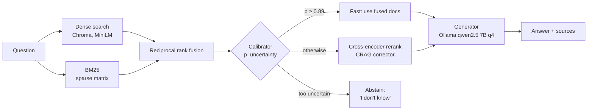

# Architecture

A FastAPI service that answers questions over an enterprise corpus with four retrieval
strategies, the most advanced of which **estimates whether retrieval succeeded before
answering** and routes accordingly. Everything runs on a CPU-only laptop.

## Strategies

| Endpoint | Pipeline | Stages |
|---|---|---|
| `POST /query/vanilla` | `pipelines/vanilla_pipeline.py` | dense → generate |
| `POST /query/hybrid` | `pipelines/hybrid_pipeline.py` | dense + BM25 → RRF → generate |
| `POST /query/crag` | `pipelines/crag_pipeline.py` | hybrid (2×k pool) → cross-encoder rerank → generate |
| `POST /query/adaptive` | `pipelines/adaptive_pipeline.py` | hybrid → calibrator → route (Fast / Corrective / Abstain) → generate |
| `POST /engine/stream` | `core/engine.py` | any of the above, streamed stage by stage (server-sent events) |

## Components

### Retrieval (`core/`)

- **`retriever_chroma.py` - dense search.** Queries the Chroma `docs` collection and
  converts Chroma's distance to a cosine `dense_score` (Chroma reports *squared* L2 for
  normalized vectors: cos = 1 − d/2). `EMBEDDING_MODEL` must match the collection's model.
- **`retriever_bm25.py` - keyword search.** Okapi BM25 with the same scoring as
  `rank_bm25` (k1 = 1.5, b = 0.75, ε-floored IDF; verified to 1e-6), stored as a
  float32 sparse matrix of precomputed term weights and cached to disk. Document text is
  not kept in memory; returned rows are hydrated from Chroma. *Why:* `rank_bm25` keeps a
  Python dict per document and needed 8 GB of RAM for 78k documents; this needs ~0.8 GB
  and starts in 1.5 s from cache.
- **`hybrid_rrf.py` - fusion.** Weighted reciprocal rank fusion, keeping both retrievers'
  scores on each fused row (the calibrator uses them). Tuned on train: α = 20, dense 0.8,
  BM25 1.0, 50 candidates per retriever. *Why:* with the original weights and equal-depth
  lists, no dense-only document could ever enter the top 10, so "hybrid" was BM25.
- **`chunking.py` - passages.** Splits long documents into ~1,000-character windows and
  picks the ones sharing most terms with the query; used for reranking and prompts.

### Correction (`core/crag_corrector.py`)

Corrective RAG: scores each candidate's best passages with the cross-encoder
`ms-marco-MiniLM-L-6-v2`, reranks by that relevance, and records the passage it judged.
*Why:* the original word-overlap grader lowered recall (0.65 → 0.52); the cross-encoder
raises it (0.716 → 0.730 on test). A relevance cutoff is configurable but off by default,
because on train every cutoff traded recall away.

### Calibrator and router (`core/calibrator.py`, `core/router.py`)

- **Calibrator:** a bootstrap ensemble of 30 logistic regressions on six standardized
  retrieval signals (BM25 top score per query term, BM25 margin, dense top cosine, dense
  margin, retriever agreement, query length). `mean` is the predicted probability that
  the retrieved set contains every gold document; `std` is disagreement across the
  ensemble, an approximation of Bayesian posterior uncertainty.
- **Router:** `Abstain` if mean < abstain threshold or std > 0.2; `Fast` if mean ≥ 0.89;
  otherwise `Corrective`. Thresholds come from out-of-fold predictions on train.
- *Why the redesign:* the original Bayesian ridge regression on unscaled features
  predicted a constant, and its predictive std (which includes label noise, ~0.46 for
  binary outcomes) always exceeded the abstain threshold, so **every query abstained**.

### Generation (`core/generator.py`)

Ollama by default (`qwen2.5:7b-instruct-q4_K_M`, a 4-bit 7B model that runs on CPU);
a Transformers 4-bit backend remains for CUDA machines. Prompts give each document an
equal share of a 4,500-character budget, filled with its most relevant passage, and tell
the model to say it does not know when the context lacks the answer. `stream()` yields
the answer as Ollama produces it.

### Service and API

- **`core/service.py`** builds everything once at startup (Chroma client, cached BM25,
  retrievers, cross-encoder, calibrator, router, pipelines).
- **`api/`**: `routes_query.py` (the four strategies), `routes_engine.py` (live stream and
  example questions), `routes_calibration.py` (refit/status), `routes_ablation.py` and
  `routes_results.py` (experiment monitor), `routes_health.py` (`/health`, `/ready`).
- **`main.py`** wires routers, static files and the two web pages.

### Website (`static/`)

- **`index.html` - Ask (real-time engine).** Streams `/engine/stream`: a live pipeline
  timeline (each stage's status, timing and findings), the calibrator's confidence on a
  gauge with routing thresholds, the answer token by token, and the sources with every score.
- **`ablation.html` - Monitor.** Overview of the running model comparison, Calibrator
  evidence, the answer feed, and the results store.
- **`app.css`** - shared design system (light/dark themes, validated color palette).

### Experiments (`scripts/`, `core/results_store.py`, `core/ablation_report.py`)

See [WORKFLOW.md](WORKFLOW.md) and [EVALUATION.md](EVALUATION.md).

## Configuration

All settings are environment variables with defaults in `config.py`: Chroma paths and
collections, models, RRF, router thresholds, CRAG, generator limits, and output folders.
