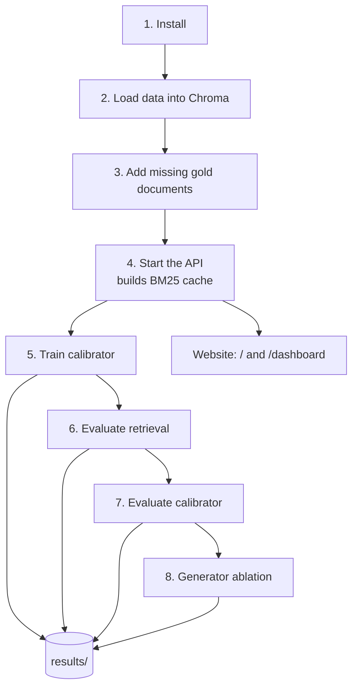

# Workflow

From an empty machine to a running website and saved results. Commands run from the
repository root with the project's virtualenv (`../venv` in the author's layout).



## 1. Install

```bash
python -m venv ../venv && ../venv/bin/pip install -r requirements.txt
```

Install [Ollama](https://ollama.com) and pull the models:

```bash
ollama pull qwen2.5:7b-instruct-q4_K_M      # generator
ollama pull phi3:mini-4k && ollama pull phi:2.7b   # ablation candidates
ollama pull llama3.1:8b-instruct-q4_K_M     # independent judge
```

## 2. Load data into Chroma

Documents go into the `docs` collection and questions into `Questions`, with
`expected_doc_ids`, `gold_answer`, `answer_facts` and `question_type` as metadata
(see [DATASET.md](DATASET.md)). Set `CHROMA_PATH` if your store is elsewhere.

## 3. Add the missing gold documents

```bash
PYTHONPATH=. ../venv/bin/python scripts/add_gold_docs.py --dry-run   # report only
PYTHONPATH=. ../venv/bin/python scripts/add_gold_docs.py
```

Safe to re-run; it only adds gold documents that are absent.

## 4. Start the API and website

```bash
../venv/bin/uvicorn main:app --port 8000
```

- `http://localhost:8000/` - **Ask**: the real-time engine
- `http://localhost:8000/dashboard` - **Monitor**: experiments and results
- `http://localhost:8000/docs` - OpenAPI reference

The first start builds the BM25 cache (~1 minute); later starts take ~1.5 s.

## 5-8. Experiments

One command runs every step in order, each saving to `results/`:

```bash
scripts/run_pipeline.sh                      # all steps
scripts/run_pipeline.sh evaluate_calibrator  # or named steps only
```

| Step | Script | Output | Time (CPU laptop) |
|---|---|---|---|
| Train calibrator | `scripts/train_calibrator.py` | `models/calibrator.pkl`, `results/calibrator_training/` | ~2 min |
| Evaluate retrieval | `scripts/evaluate_retrieval.py` | `results/retrieval_eval/` | ~15 min |
| Evaluate calibrator | `scripts/evaluate_calibrator.py` | `results/calibrator_eval/` | ~1 h |
| Generator ablation | `scripts/run_local_generator_ablation.py` | `data/ablation_runs/full_benchmark/`, snapshots in `results/generator_ablation/` | ~2 days for 500 questions |

The calibrator evaluation and the ablation are **crash-safe**: they record each question
as it finishes and resume after an interruption. Logs are in `data/logs/`.

Snapshot an in-progress ablation at any time:

```bash
PYTHONPATH=.:scripts ../venv/bin/python scripts/run_local_generator_ablation.py --summarize --save
```

## Results store

Every result is a folder `results/<kind>/<timestamp>/` with `result.json` (metrics),
per-question CSVs and `meta.json` (git commit, full config snapshot, command, Python
version). `results/index.json` and `results/README.md` list them all; the Monitor's
**Results** view browses and downloads them.

## Tests

```bash
../venv/bin/python -m unittest discover -s tests -t .
```

Unit tests use fakes, so they need neither Chroma nor Ollama.

## Laptop notes

The reference machine is a CPU-only i5-1335U with 14 GB RAM. Steps run one at a time;
the pipeline caps itself at 6 threads so the website stays responsive; Ollama unloads
candidate models after each call because its prompt cache otherwise grows until the
kernel kills it.
