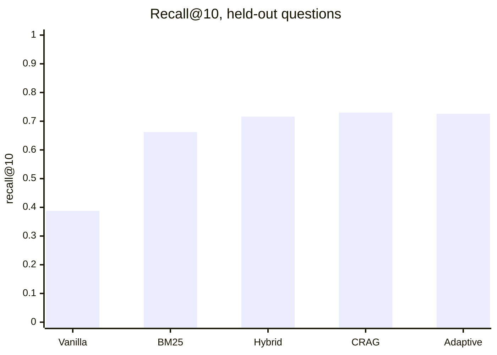

# Results

Every experiment saved by this repository, newest first. Each folder holds `result.json` (metrics),
per-question CSVs and `meta.json` (git commit, configuration and hardware it was produced on).
This page is generated by `core/results_store.py`; reproduce any result with `scripts/run_pipeline.sh`
(see [docs/WORKFLOW.md](../docs/WORKFLOW.md)).

## Retrieval

Recall@10 on 236 answerable **held-out** questions: the share of each question's
gold documents among the documents handed to the generator.

| Strategy | Recall@10 | MRR | nDCG@10 | Found all gold docs | Latency p50 | p95 |
|---|---:|---:|---:|---:|---:|---:|
| Vanilla (dense) | **0.388** | 0.349 | 0.331 | 34.7% | 0.48 s | 0.88 s |
| BM25 | **0.662** | 0.608 | 0.594 | 60.2% | 0.01 s | 0.01 s |
| Hybrid (RRF) | **0.716** | 0.588 | 0.594 | 65.7% | 0.58 s | 0.91 s |
| CRAG (rerank) | **0.730** | 0.707 | 0.680 | 66.9% | 5.88 s | 8.68 s |
| Adaptive (calibrated) | **0.726** | 0.700 | 0.673 | 66.5% | 6.09 s | 9.16 s |

MRR and nDCG reward putting the gold documents *first*, which is what the reranker buys; latencies were
measured on a CPU-only laptop while other jobs were running, so compare them relative to each other.

Adaptive routing sent 37 questions down the fast path, 207 to cross-encoder correction and 1 to abstention. [Per-question data](retrieval_eval/20261001T161255Z_test)

## Calibrator

Predicts, before answering, whether retrieval found every gold document; the router uses it
to answer fast, rerank first, or abstain.

| Held-out metric | Calibrator | Constant guess |
|---|---:|---:|
| AUC (0.5 = chance) | **0.725** | 0.500 |
| Brier score (lower is better) | **0.202** | 0.232 |

Suggested thresholds from out-of-fold training predictions: fast path if p ≥ 0.89; no confidence cutoff justified abstaining, so abstention is left to model uncertainty. [Training run and model file](calibrator_training/20261001T145020Z)

| Policy | Recall@10 | Retrieval time per query |
|---|---:|---:|
| Never rerank (hybrid) | 0.716 | 0.22 s |
| Always rerank (CRAG) | 0.730 | 3.57 s |
| **Calibrated routing** | **0.730** | **3.04 s** |

Routing matches always-rerank recall and saves 15% of its retrieval time. [Evaluation data](calibrator_eval/20261001T154033Z)

## Generator comparison

Same retrieved context for every model; answers graded by an independent judge (`llama3.1:8b-instruct-q4_K_M`). **25 of 500 questions graded so far.**

| Model | Correct | Facts stated | Score | 95% interval | Avg. answer time |
|---|---:|---:|---:|---|---:|
| Qwen2.5-7B-Instruct | 56% | 70% | **0.47** | 0.29 – 0.65 | 91 s |
| Phi-3-mini-4k-instruct | 44% | 57% | **0.32** | 0.15 – 0.51 | 76 s |
| phi-2 | 32% | 68% | **0.22** | 0.09 – 0.37 | 42 s |

Score = correct × share of gold facts stated.

| Comparison | Score difference | 95% interval | Verdict |
|---|---:|---|---|
| Qwen2.5-7B-Instruct vs Phi-3-mini-4k-instruct | +0.16 | +0.03 – +0.29 | real difference |
| Qwen2.5-7B-Instruct vs phi-2 | +0.25 | +0.09 – +0.43 | real difference |
| Phi-3-mini-4k-instruct vs phi-2 | +0.10 | -0.08 – +0.28 | not yet distinguishable |

Judge check on 25 questions: gold answers judged correct 100%; another question's answer judged correct 0% (9% of its facts falsely credited). [Answers, judgments and per-question table](generator_ablation/20261001T015505Z_full_benchmark)

## All saved results

| Date (UTC) | Experiment | Headline | Folder | Commit |
|---|---|---|---|---|
| 2026-10-01 16:12 | Retrieval evaluation: Retrieval strategies, test split, top-10 | hybrid 0.716, crag 0.730, adaptive 0.726 | [20261001T161255Z_test](retrieval_eval/20261001T161255Z_test) | `ca52165 + local changes` |
| 2026-10-01 15:40 | Calibrator evaluation: Calibrator routing and calibration, 245 test questions | auc 0.725, adaptive recall 0.730, crag recall 0.730, time saved 0.148 | [20261001T154033Z](calibrator_eval/20261001T154033Z) | `4d71d73 + local changes` |
| 2026-10-01 15:10 | Retrieval evaluation: Retrieval strategies, test split, top-10 | hybrid 0.716, crag 0.730, adaptive 0.726 | [20261001T151024Z_test](retrieval_eval/20261001T151024Z_test) | `cf61fc2 + local changes` |
| 2026-10-01 14:50 | Calibrator training: Calibrator fit on 245 train questions | test auc 0.725, test brier 0.202, brier constant 0.232 | [20261001T145020Z](calibrator_training/20261001T145020Z) | `26f0ff1 + local changes` |
| 2026-10-01 01:55 | Generator ablation: Generators on 25/500 questions (full_benchmark) | Qwen2.5-7B-Instruct 0.472, Phi-3-mini-4k-instruct 0.317, phi-2 0.222, n 25 | [20261001T015505Z_full_benchmark](generator_ablation/20261001T015505Z_full_benchmark) | `26f0ff1 + local changes` |
